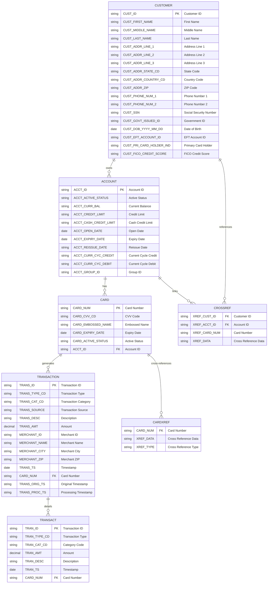

# CARDDEMO Data Model - Mermaid Diagram

Based on the CARDDEMO drawio file, here's the data model represented in Mermaid format:

## Key Relationships

1. **Customer to Account**: One-to-many relationship where customers can own multiple accounts
2. **Account to Card**: One-to-many relationship where accounts can have multiple cards
3. **Card to Transaction**: One-to-many relationship where cards generate multiple transactions
4. **Cross-Reference Tables**: Support many-to-many relationships and additional data linking

## Data Model Notes

- The model supports a typical credit card system with customers, accounts, cards, and transactions
- Cross-reference tables (CROSSREF, CARDXREF) provide flexibility for complex relationships
- Transaction data is captured with merchant information and timestamps
- The model includes both current and historical transaction processing (TRANSACTION vs TRANSACT)
- Customer data includes comprehensive personal and financial information
- Account management includes credit limits, balances, and lifecycle dates

This data model supports the CARDDEMO application's core functionality for managing credit card operations, customer relationships, and transaction processing in a mainframe COBOL environment.