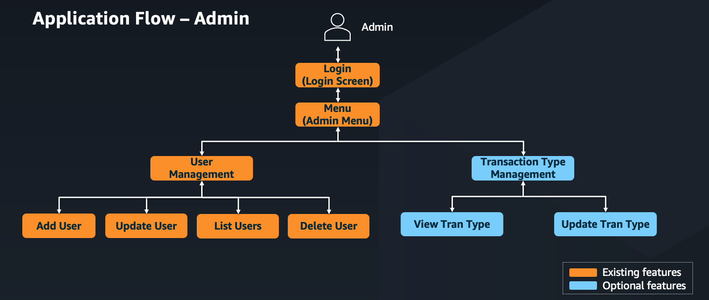
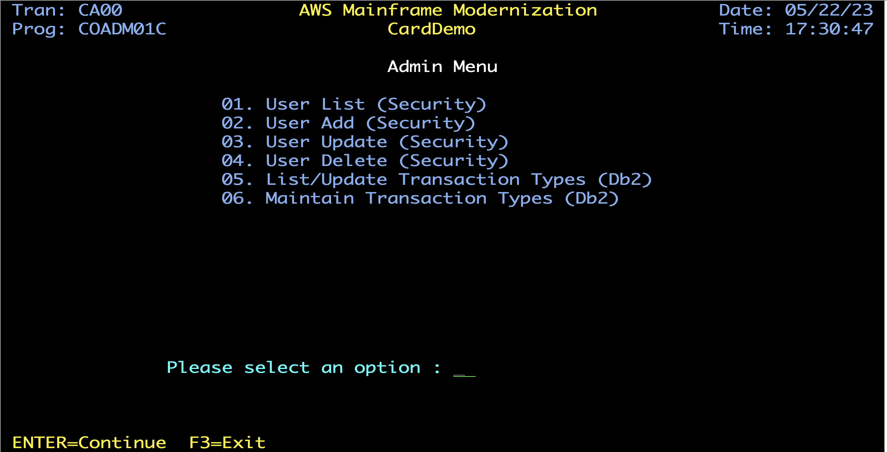

# CardDemo - Mainframe Credit Card Management Application


## Executive Summary
CardDemo is a comprehensive mainframe application that simulates a credit card management system. Designed specifically to showcase AWS and partner technologies for mainframe migration and modernization scenarios, it provides a realistic environment for testing various modernization approaches including discovery, migration, performance testing, service enablement, and more.

## Table of Contents
- [Description](#description)
- [Technologies](#technologies)
- [Optional Features](#optional-features)
- [Installation](#installation)
- [Running Batch Jobs](#running-batch-jobs)
- [Application Details](#application-details)
  - [User Functions](#user-functions)
  - [Admin Functions](#admin-functions)
  - [Application Inventory](#application-inventory)
  - [Application Screens](#application-screens)
- [Technical Highlights](#technical-highlights)
- [Support](#support)
- [Roadmap](#roadmap)
- [Contributing](#contributing)
- [License](#license)
- [Project Status](#project-status)

## Description
CardDemo is a mainframe application designed to test and showcase AWS and partner technology for mainframe migration and modernization use-cases. It provides a realistic environment for:

- Application discovery and analysis
- Migration assessment and planning
- Modernization strategy development
- Performance testing
- System augmentation
- Service enablement and extraction
- Test creation and automation

The application intentionally incorporates various coding styles and patterns to exercise analysis, transformation, and migration tooling across different mainframe programming paradigms.

## Technologies

### Core Technologies
- **COBOL**: Primary programming language
- **CICS**: Transaction processing
- **VSAM (KSDS with AIX)**: Data storage
- **JCL**: Batch processing
- **RACF**: Security
- **ASSEMBLER**: System-level programming
  - MVSWAIT: Timer control for batch jobs
  - COBDATFT: Date format conversion utility

### Optional Technologies
- **Db2**: Relational database management
- **IMS DB**: Hierarchical database
- **MQ**: Message queuing
- **JCL Utilities**: FTP, TXT2PDF, DB2 LOAD/UNLOAD, IMS DB LOAD/UNLOAD, Internal Reader
- **Advanced Data Formats**: COMP, COMP-3, Zoned Decimal, Signed, Unsigned
- **Additional Dataset Types**: VSAM (ESDS/RRDS), GDG, PDS
- **Record Formats**: VB, FBA, and others
- **Complex Copybook Structures**: REDEFINES, OCCURS, OCCURS DEPENDING ON

## Optional Features

CardDemo includes several optional modules that extend the base functionality:

1. **Credit Card Authorizations with IMS, DB2, and MQ**
   - Simulate credit card authorization requests using MQ
   - Retrieve customer data from IMS databases
   - Log transactions in DB2 tables
   - Features include:
     - Authorization request processing
     - Pending authorization summary and details
     - Batch purging of expired authorizations
   - More details: [Pending Authorization Extension](./app/app-authorization-ims-db2-mq)

2. **Transaction Type Management with DB2**
   - Maintain transaction type reference data in DB2 tables
   - Add, update, or delete transaction types from CICS transactions
   - Manage transaction types through batch jobs
   - Demonstrates DB2 integration patterns including cursors and SQL operations

3. **Account Extractions using MQ and VSAM**
   - Extract and transmit account data through MQ channels
   - System date inquiry via MQ (CDRD transaction)
   - Account details inquiry via MQ (CDRA transaction)
   - Demonstrates asynchronous processing patterns

4. **Audit Trail System**
   - Audit logging for all data modifications
   - VSAM-based audit storage with timestamp-based keys
   - Automated logging of customer, account, and transaction changes
   - Centralized audit subprogram for consistent logging across applications

5. **Additional JCL Utilities**
   - FTP integration
   - Text-to-PDF conversion
   - DB2 and IMS DB load/unload operations
   - Internal reader functionality

## Installation

### Prerequisites
- Mainframe environment with CICS, VSAM, and JCL support
- Optional: DB2, IMS DB, and MQ for extended features
- File transfer capability between local environment and mainframe

### Installation Steps

1. **Prepare Your Environment**
   - Clone this repository to your local development environment
   - Ensure you have appropriate access to your mainframe environment

2. **Create Mainframe Datasets**
   - Define a High Level Qualifier (HLQ) for your datasets
   - Create the following datasets with the specified formats:

     | HLQ    | Name          | Format | Length |
     | :----- | :------------ | :----- | -----: |
     | AWS.M2 | CARDDEMO.JCL  | FB     |     80 |
     | AWS.M2 | CARDDEMO.PROC | FB     |     80 |
     | AWS.M2 | CARDDEMO.CBL  | FB     |     80 |
     | AWS.M2 | CARDDEMO.CPY  | FB     |     80 |
     | AWS.M2 | CARDDEMO.BMS  | FB     |     80 |
     | AWS.M2 | CARDDEMO.ASM  | FB     |     80 |
     | AWS.M2 | CARDDEMO.MACLIB| FB    |     80 |

3. **Upload Source Code**
   - Upload the application source folders from the repository to your mainframe
   - Use $INDFILE or your preferred file transfer tool
   - Ensure proper transfer modes (binary/text) as appropriate

4. **Upload Sample Data**
   - Transfer the sample data from the `main/-/data/EBCDIC/` folder to the mainframe
   - Use binary transfer mode to preserve data integrity
   - Create the following datasets:

     | Dataset name                      | Description                                  | Copybook     | Format | Length |
     | :---------------------------------| :------------------------------------------- | :----------- | :----- | -----: |
     | AWS.M2.CARDDEMO.USRSEC.PS         | User Security file                           | CSUSR01Y     | FB     |     80 |
     | AWS.M2.CARDDEMO.ACCTDATA.PS       | Account Data                                 | CVACT01Y     | FB     |    300 |
     | AWS.M2.CARDDEMO.CARDDATA.PS       | Card Data                                    | CVACT02Y     | FB     |    150 |
     | AWS.M2.CARDDEMO.CUSTDATA.PS       | Customer Data                                | CVCUS01Y     | FB     |    500 |
     | AWS.M2.CARDDEMO.CARDXREF.PS       | Customer Account Card Cross reference        | CVACT03Y     | FB     |     50 |
     | AWS.M2.CARDDEMO.DALYTRAN.PS.INIT  | Transaction database initialization record   | CVTRA06Y     | FB     |    350 |
     | AWS.M2.CARDDEMO.DALYTRAN.PS       | Transaction data for posting                 | CVTRA06Y     | FB     |    350 |
     | AWS.M2.CARDDEMO.TRANSACT.VSAM.KSDS| Online transaction data                      | CVTRA05Y     | FB     |    350 |
     | AWS.M2.CARDDEMO.DISCGRP.PS        | Disclosure Groups                            | CVTRA02Y     | FB     |     50 |
     | AWS.M2.CARDDEMO.TRANCATG.PS       | Transaction Category Types                   | CVTRA04Y     | FB     |     60 |
     | AWS.M2.CARDDEMO.TRANTYPE.PS       | Transaction Types                            | CVTRA03Y     | FB     |     60 |
     | AWS.M2.CARDDEMO.TCATBALF.PS       | Transaction Category Balance                 | CVTRA01Y     | FB     |     50 |
     | AWS.M2.CARDDEMO.AUDITLOG.VSAM.KSDS| Audit trail log data                         | AUDITLOG     | FB     |    565 |

5. **Initialize the Environment**
   - Execute the following JCLs in sequence:

     | Jobname  | Purpose                                           | Optional Module |
     | :------- | :------------------------------------------------ |:--------------- |
     | DUSRSECJ | Sets up user security VSAM file                   |                 |
     | CLOSEFIL | Closes files opened by CICS                       |                 |
     | ACCTFILE | Loads Account database using sample data          |                 |
     | CARDFILE | Loads Card database with credit card sample data  |                 |
     | CUSTFILE | Creates customer database                         |                 |
     | XREFFILE | Loads Customer Card account cross reference       |                 |
     | CREADB21 | Creates CardDemo Db2 database and loads tables    | Db2: Transaction Type Mgmt |
     | TRANFILE | Copies initial Transaction file to VSAM           |                 |
     | TRANEXTR | Extracts TRAN type and category tables from Db2   | Db2: Transaction Type Mgmt |
     | DISCGRP  | Copies initial Disclosure Group file to VSAM      |                 |
     | TCATBALF | Copies initial TCATBALF file to VSAM              |                 |
     | TRANCATG | Copies initial transaction category file to VSAM  |                 |
     | TRANTYPE | Copies initial transaction type file to VSAM      |                 |
     | OPENFIL  | Makes files available to CICS                     |                 |
     | DEFGDGB  | Defines GDG Base                                  |                 |
     | DEFGDGD  | Defines GDG Bases added for Db2                   |                 |
     | DEFAUDIT | Defines VSAM audit cluster for audit trail        |                 |

6. **Compile the Programs**
   - Use your standard mainframe compilation procedures
   - Sample JCLs are provided in the samples folder to assist with compilation

7. **Configure CICS Resources**
   - Option 1 (Preferred): Use the DFHCSDUP JCL with the CSD file in the CSD folder
   - Option 2: Use CEDA transaction to manually define resources:

     ```
     DEFINE LIBRARY(COM2DOLL) GROUP(CARDDEMO) DSNAME01(&HLQ..LOADLIB)
     DEF PROGRAM(COCRDLIC) GROUP(CARDDEMO)
     DEF MAPSET(COCRDLI) GROUP(CARDDEMO)
     DEFINE PROGRAM(COSGN00C) GROUP(CARDDEMO) DA(ANY) TRANSID(CC00) DESCRIPTION(LOGIN)
     DEFINE TRANSACTION(CC00) GROUP(CARDDEMO) PROGRAM(COSGN00C) TASKDATAL(ANY)
     ```

8. **Install and Load Resources**
   - Install the resources in your CICS region:

     ```
     CEDA INSTALL TRANS(CCLI) GROUP(CARDDEMO)
     CEDA INSTALL FILE(CARDDAT) GROUP(CARDDEMO)
     CECI LOAD PROG(COCRDUP)
     CECI LOAD PROG(COCRDUPC)
     ```

   - Execute NEWCOPY for mapsets and programs:

     ```
     CEMT SET PROG(COCRDUP) NEWCOPY
     CEMT SET PROG(COCRDUPC) NEWCOPY
     ```

### Accessing the Application
- **Online Functions**: Start the CardDemo application using the CC00 transaction
  - Admin access: Use userid ADMIN001 with password PASSWORD
  - User access: Use userid USER0001 with password PASSWORD
- **Batch Functions**: See the "Running Batch Jobs" section below

## Running Batch Jobs

Execute the following JCLs in sequence to run the full batch process:

| Jobname  | Purpose                                             | Optional Module |
| :------- | :-------------------------------------------------- |:--------------- |
| CLOSEFIL | Closes files opened by CICS                         |                 |
| ACCTFILE | Loads Account database using sample data            |                 |
| CARDFILE | Loads Card database with credit card sample data    |                 |
| XREFFILE | Loads Customer Card account cross reference to VSAM |                 |
| CUSTFILE | Creates customer database                           |                 |
| TRANBKP  | Creates Transaction database                        |                 |
| TRANEXTR | Extracts latest Db2 data for Transaction types      | Db2: Transaction Type Mgmt |
| TRANCATG | Copies latest transaction category file to VSAM     |                 |
| TRANTYPE | Copies latest transaction type file to VSAM         |                 |
| DISCGRP  | Copies initial disclosure Group file to VSAM        |                 |
| TCATBALF | Copies initial TCATBALF file to VSAM                |                 |
| DUSRSECJ | Sets up user security VSAM file                     |                 |
| POSTTRAN | Core transaction processing job                     |                 |
| INTCALC  | Run interest calculations                           |                 |
| TRANBKP  | Backup Transaction database                         |                 |
| COMBTRAN | Combine system transactions with daily ones         |                 |
| CREASTMT | Produce transaction statement                       |                 |
| TRANIDX  | Define alternate index on transaction file          |                 |
| OPENFIL  | Makes files available to CICS                       |                 |
| WAITSTEP | Defines a step to wait job for given time           |                 |
| CBPAUP0J | Purge expired authorizations                        | IMS-DB2-MQ: Pending Authorizations |

## Application Details

CardDemo is a comprehensive credit card management application built primarily using COBOL. It provides functionality for managing accounts, credit cards, transactions, and bill payments.

### User Types

The application supports two user roles:
- **Regular Users**: Can perform standard card management functions
- **Admin Users**: Can perform administrative functions like user management

### User Functions


The regular user can perform the following functions:
- View and update account information
- Manage credit cards
- View, add, and process transactions
- Generate transaction reports
- Make bill payments
- View pending authorizations (with optional module)

### Admin Functions



Admin users can perform the following functions:
- User management (list, add, update, delete)
- Transaction type management (with DB2 optional module)

### Application Inventory

#### Online Components

| Transaction | BMS Map | Program  | Function                        | Optional Module                    | Notes                                                     |
|:------------|:--------|:---------|:--------------------------------|:-----------------------------------|:----------------------------------------------------------|
| CC00        | COSGN00 | COSGN00C | Signon Screen                   |                                    |                                                           |
| CM00        | COMEN01 | COMEN01C | Main Menu                       |                                    |                                                           |
| CAVW        | COACTVW | COACTVWC | Account View                    |                                    |                                                           |
| CAUP        | COACTUP | COACTUPC | Account Update                  |                                    |                                                           |
| CCLI        | COCRDLI | COCRDLIC | Credit Card List                |                                    |                                                           |
| CCDL        | COCRDSL | COCRDSLC | Credit Card View                |                                    |                                                           |
| CCUP        | COCRDUP | COCRDUPC | Credit Card Update              |                                    |                                                           |
| CT00        | COTRN00 | COTRN00C | Transaction List                |                                    |                                                           |
| CT01        | COTRN01 | COTRN01C | Transaction View                |                                    |                                                           |
| CT02        | COTRN02 | COTRN02C | Transaction Add                 |                                    |                                                           |
| CR00        | CORPT00 | CORPT00C | Transaction Reports             |                                    |                                                           |
| CB00        | COBIL00 | COBIL00C | Bill Payment                    |                                    |                                                           |
| CPVS        | COPAU00 | COPAUS0C | Pending Authorization Summary   | IMS-DB2-MQ: Pending Authorizations | Read IMS and VSAM                                         |
| CPVD        | COPAU01 | COPAUS1C | Pending Authorization Details   | IMS-DB2-MQ: Pending Authorizations | Update IMS and Insert DB2                                 |
| CP00        |         | COPAUA0C | Process Authorization Requests  | IMS-DB2-MQ: Pending Authorizations | MQ trigger, request and response; Insert and Update to IMS|
| CA00        | COADM01 | COADM01C | Admin Menu                      | Db2: Transaction Type Mgmt         |                                                           |
| CU00        | COUSR00 | COUSR00C | List Users                      |                                    |                                                           |
| CU01        | COUSR01 | COUSR01C | Add User                        |                                    |                                                           |
| CU02        | COUSR02 | COUSR02C | Update User                     |                                    |                                                           |
| CU03        | COUSR03 | COUSR03C | Delete User                     |                                    |                                                           |
| CTTU        | COTRTUP | COTRTUPC | Tran Type add/edit              | Db2: Transaction Type Mgmt         | Update and insert on Db2                                  |
| CTLI        | COTRTLI | COTRTLIC | Tran Type list/update/delete    | Db2: Transaction Type Mgmt         | Demonstrates cursor and delete in Db2                     |
| CDRD        |         | CODATE01 | Inquire System Date via MQ      | MQ Integration                     | Demonstrates MQ request/response pattern                  |
| CDRA        |         | COACCT01 | Inquire account details via MQ  | MQ Integration                     | Demonstrates MQ request/response pattern                  |

#### Batch Components

| Job      | Program  | Function                                             | Optional Module |
|:---------|:---------|:-----------------------------------------------------|:---------------|
| DUSRSECJ | IEBGENER | Initial Load of User security file                   |                |
| DEFGDGB  | IDCAMS   | Setup GDG Bases                                      |                |
| DEFGDGD  | IDCAMS   | Setup more GDG Bases for Db2                         |                |
| ACCTFILE | IDCAMS   | Refresh Account Master                               |                |
| CARDFILE | IDCAMS   | Refresh Card Master                                  |                |
| CUSTFILE | IDCAMS   | Refresh Customer Master                              |                |
| CREADB21 | DSNTEP4  | Creates CardDemo Db2 database and loads tables       | Db2: Transaction Type Mgmt |
| TRANEXTR | DSNTIAUL | Extracts latest Db2 data for Transaction types       | Db2: Transaction Type Mgmt |
| DISCGRP  | IDCAMS   | Load Disclosure Group File                           |                |
| TRANFILE | IDCAMS   | Load Transaction Master file                         |                |
| TRANCATG | IDCAMS   | Load Transaction category types                      |                |
| TRANTYPE | IDCAMS   | Load Transaction type file                           |                |
| XREFFILE | IDCAMS   | Account, Card and Customer cross reference           |                |
| CLOSEFIL | IEFBR14  | Close VSAM files in CICS                             |                |
| TCATBALF | IDCAMS   | Refresh Transaction Category Balance                 |                |
| TRANBKP  | IDCAMS   | Refresh Transaction Master                           |                |
| POSTTRAN | CBTRN02C | Transaction processing job                           |                |
| TRANIDX  | IDCAMS   | Define AIX for transaction file                      |                |
| OPENFIL  | IEFBR14  | Open files in CICS                                   |                |
| INTCALC  | CBACT04C | Run interest calculations                            |                |
| COMBTRAN | SORT     | Combine transaction files                            |                |
| CREASTMT | CBSTM03A | Produce transaction statement                        |                |
| TRANREPT | CBTRN03C | Transaction Report - Submitted from CICS             |                |
| ESDSRRDS | IDCAMS   | Create ESDS and RRDS VSAM files                      |                |
| CBPAUP0J | CBPAUP0C | Purge Expired Authorizations                         | IMS-DB2-MQ: Pending Authorizations |
| MNTTRDB2 | COBTUPDT | Maintain Transaction type table                      | Db2: Transaction Type Mgmt |
| REPAUDIT | IDCAMS   | VSAM audit file maintenance and reporting            | Audit Trail     |
| WAITSTEP | COBSWAIT | Wait job for given time                              |                |

### Application Screens

#### Signon Screen


#### Main Menu


**Note**: Option 11 (Pending Authorizations) is only available with the optional Credit Card Authorizations feature. Please refer to [the authorization documentation](./app/app-authorization-ims-db2-mq) for details.

#### Admin Menu



**Note**: Options 5 and 6 will be enabled only if you install the Transaction Type Management with DB2 optional feature (transactions CTTU and CTLI).

## Audit Trail System

CardDemo includes an audit trail system that automatically logs all data modifications across the application. This system provides traceability for compliance and monitoring purposes.

### Architecture Overview


### Key Components

#### Programs
- **COAUDIT.cbl**: Central audit subprogram that handles all audit logging operations
- **Modified Programs**: COACTUPC, COBIL00C, COTRN02C enhanced with audit trail calls

#### Data Structures
- **AUDITLOG.cpy**: 565-byte audit record structure with customer, account, and transaction data using REDEFINES
- **CVAUD01Y.cpy**: Parameter interface for audit subprogram calls

#### Storage
- **AUDITLOG.VSAM**: KSDS file with 35-byte composite key (log type + timestamp + user ID)
- **565-byte fixed records** optimized for storage efficiency with COMP/COMP-3 fields

#### JCL Jobs
- **DEFAUDIT.jcl**: Creates and defines the VSAM audit cluster
- **REPAUDIT.jcl**: Maintenance operations for audit file backup and reporting

### Features
- **Automatic Logging**: Transparent audit trail integration in existing programs
- **Timestamp-based Keys**: Ensures chronological ordering and uniqueness
- **Multi-record Support**: Handles customer, account, and transaction record types
- **Error Handling**: Comprehensive error detection and reporting
- **CICS Integration**: Full CICS resource definitions included

### Audit Events Logged
- Customer record updates (COACTUPC)
- Account record updates (COACTUPC, COBIL00C)
- Transaction record creation (COTRN02C, COBIL00C)
- User identification and action tracking

## Technical Highlights

| Component | Domain Features | Technical Features |
|:----------|:----------------|:-------------------|
| **Base Application** | Customer<br>Account<br>Card<br>Transaction<br>Bill Payment<br>Statement/Report<br>Audit Trail | COBOL<br>CICS<br>JCL (Batch)<br>VSAM (KSDS with AIX)<br>Timestamp-based audit logging |
| **Optional Features** | Authorization<br>Fraud<br>Transaction Type (Extension) | DB2<br>MQ<br>IMS DB<br>JCL Utilities<br>Complex data formats<br>Various dataset types<br>Advanced copybook structures |

## Support

For questions, issues, or improvement requests, please raise an issue in the repository with detailed information about your concern. The maintainers will respond according to availability.

## Roadmap

The following features are planned for upcoming releases:

1. **Additional Database Syntax Usage Scenarios**
   - DB2 Rewards: Calculate rewards for transactions based on transaction types, categories, and rules
     - Will include stored procedures, functions, and dynamic SQL
   - Hierarchical database: IMS DC implementation

2. **Integration Enhancements**
   - FTP and SFTP integration
   - Web Service connectivity
   - Exposure of transactions for distributed application integration

## Contributing

We welcome contributions and enhancements to this codebase from the mainframe community. To contribute:

1. Fork the repository
2. Create your feature branch
3. Implement your changes with appropriate tests
4. Submit a pull request with a clear description of the changes

Feel free to raise issues, create code, and submit merge requests for enhancements to help build this application as a resource for programmers wanting to understand and modernize their mainframes.

## License

This project is intended to be a community resource and is released under the Apache 2.0 license.

## Project Status

The CardDemo application has been enhanced with optional features that extend its functionality:
- Credit Card Authorizations with IMS, DB2, and MQ
- Transaction Type Management with DB2
- Account Extractions using MQ and VSAM
- Audit Trail System
- Additional JCL Utilities
- Enhanced Data and Copybook Features

These optional features make CardDemo an even more useful resource for customers looking to modernize their mainframe applications. With modules for DB2, MQ, IMS DB, audit trail logging, JCL utilities, and more data formats now available, customers can leverage CardDemo to test a wider array of mainframe migration, refactoring, replatforming, and augmentation scenarios.

Last updated: September 2025

