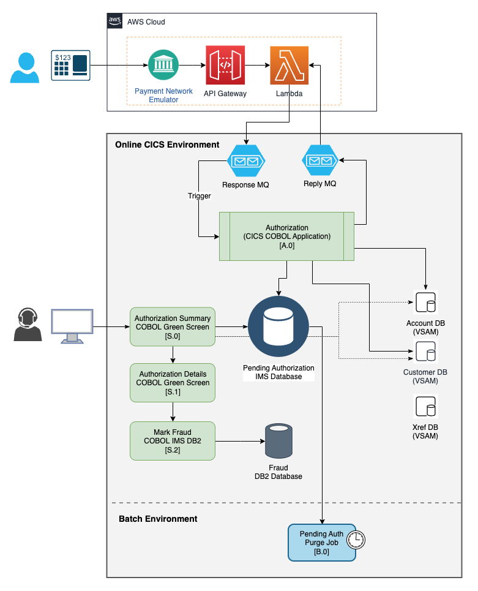
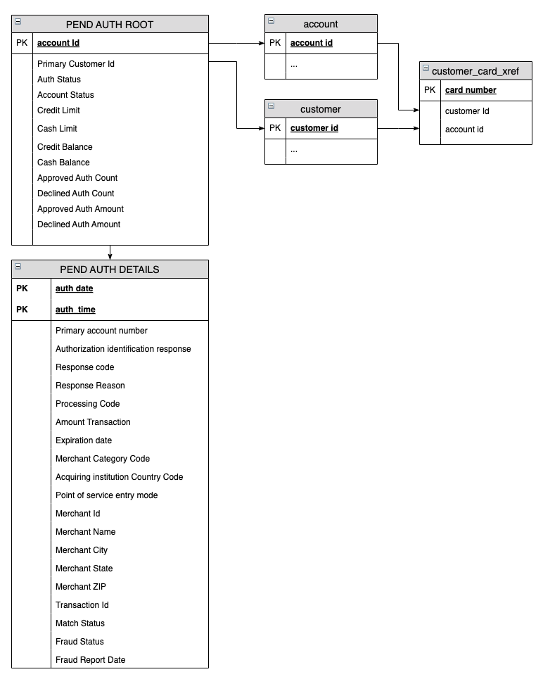
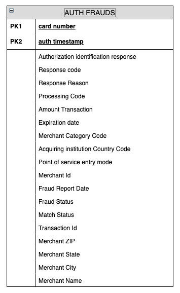
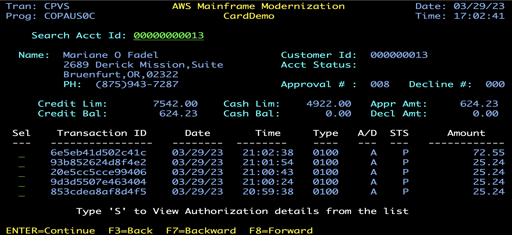
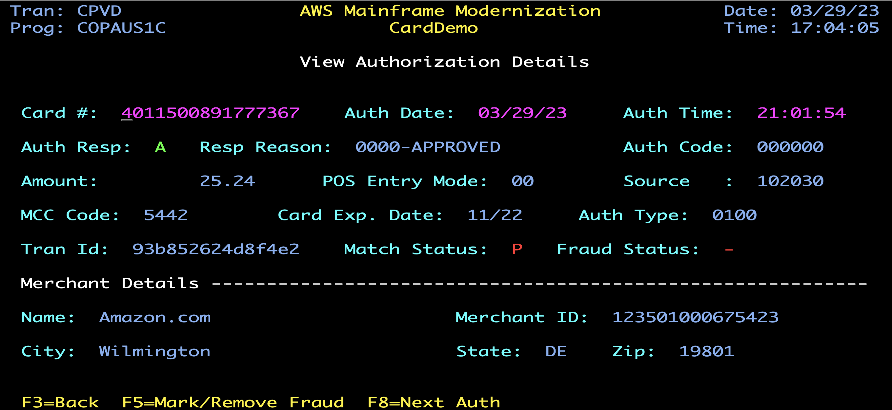
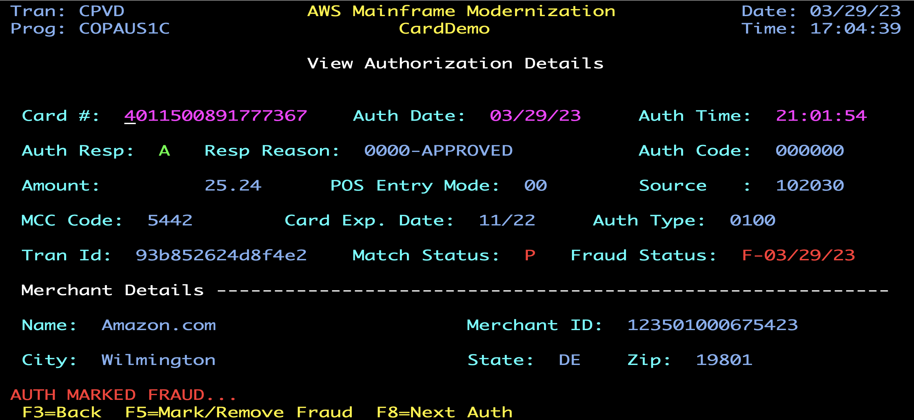

# CardDemo Extension - Credit Card Authorizations with IMS, DB2, and MQ


## Overview
The Credit Card Authorizations extension enhances CardDemo with a comprehensive authorization processing system that integrates IMS DB, DB2, and MQ technologies. This extension simulates real-world credit card authorization flows, from initial merchant request to approval/decline decisions, with fraud detection capabilities.

## Table of Contents
- [Features](#features)
- [Technologies](#technologies)
- [Architecture](#architecture)
- [Business Logic](#business-logic)
- [Installation](#installation)
  - [Prerequisites](#prerequisites)
  - [IMS Database Setup](#ims-database-setup)
  - [DB2 Table Setup](#db2-table-setup)
  - [Program Compilation](#program-compilation)
  - [CICS Resources](#cics-resources)
- [Application Components](#application-components)
  - [Programs](#programs)
  - [Copybooks](#copybooks)
  - [CICS Transactions](#cics-transactions)
  - [CICS Screens](#cics-screens)
  - [JCL](#jcl)
  - [IMS DB Components](#ims-db-components)
  - [DB2 Components](#db2-components)
  - [MQ Configuration](#mq-configuration)
- [Data Models](#data-models)
  - [MQ Message Formats](#mq-message-formats)
  - [IMS DB Structure](#ims-db-structure)
  - [DB2 Schema](#db2-schema)
- [User Interface](#user-interface)
- [License](#license)

## Features

This extension adds the following capabilities to CardDemo:

- Real-time credit card authorization processing via MQ
- Authorization request validation and business rule application
- Storage of authorization details in IMS hierarchical database
- Fraud detection and reporting with DB2 integration
- Two-phase commit transactions across IMS DB and DB2
- Authorization history viewing and management
- Batch purging of expired authorizations

## Technologies

The Credit Card Authorizations extension leverages:

- **COBOL**: Core business logic implementation
- **CICS**: Transaction processing and screen management
- **IMS DB**: Hierarchical database for authorization storage
- **DB2**: Relational database for fraud analytics
- **MQ**: Message queuing for authorization requests/responses
- **VSAM**: For account and customer data access

## Architecture



*Note: The Cloud client component shown in the diagram is not included with the example code. Any MQ-compatible client can be used to send authorization requests in the specified format.*

## Business Logic

The authorization extension implements the following business processes:

### 1. Authorization Processing
- Cloud-based POS emulator sends authorization requests via MQ
- CICS program processes requests triggered by MQ messages
- Account and customer data retrieved via VSAM cross-reference
- Business rules applied to approve or decline the request
- Response sent back via reply MQ queue
- Authorization details stored in IMS database

### 2. Authorization Management
- View account and authorization summaries
- Examine detailed authorization information
- Navigate through multiple authorizations
- Mark suspicious transactions as fraudulent
- Store fraud cases in DB2 for analytics

### 3. Batch Processing
- Daily purging of expired authorizations
- Adjustment of available credit when unmatched authorizations are deleted

## Installation

### Prerequisites

This extension requires the base CardDemo application to be installed first. Please follow the [main installation guide](../../README.md#installation) to set up the core application before proceeding with this extension.

### IMS Database Setup

The Credit Card Authorizations extension uses a HIDAM IMS database structure. Work with your IMS database administrator to:

1. Create the necessary IMS databases using the supplied DBDs:
   - DBPAUTP0 (HIDAM primary database)
   - DBPAUTX0 (HIDAM index)

2. Install the PSBs:
   - PSBPAUTB (BMP PSB)
   - PSBPAUTL (Load PSB)

The DBD and PSB definitions are provided in the `app/app-authorization-ims-db2-mq/ims` directory.

### DB2 Table Setup

Execute the following DB2 scripts to create the required table and index for fraud tracking:

```sql
CREATE TABLE <<db2-schema>>.AUTHFRDS                   
(CARD_NUM              CHAR(16)    NOT NULL,
AUTH_TS                TIMESTAMP   NOT NULL,
AUTH_TYPE              CHAR(4)             ,
CARD_EXPIRY_DATE       CHAR(4)             ,
MESSAGE_TYPE           CHAR(6)             ,
MESSAGE_SOURCE         CHAR(6)             ,
AUTH_ID_CODE           CHAR(6)             ,
AUTH_RESP_CODE         CHAR(2)             ,
AUTH_RESP_REASON       CHAR(4)             ,
PROCESSING_CODE        CHAR(6)             ,
TRANSACTION_AMT        DECIMAL(12,2)       ,
APPROVED_AMT           DECIMAL(12,2)       ,
MERCHANT_CATAGORY_CODE CHAR(4)             ,
ACQR_COUNTRY_CODE      CHAR(3)             ,
POS_ENTRY_MODE         SMALLINT            ,
MERCHANT_ID            CHAR(15)            ,
MERCHANT_NAME          VARCHAR(22)         ,
MERCHANT_CITY          CHAR(13)            ,
MERCHANT_STATE         CHAR(02)            ,
MERCHANT_ZIP           CHAR(09)            ,
TRANSACTION_ID         CHAR(15)            ,
MATCH_STATUS           CHAR(1)             ,
AUTH_FRAUD             CHAR(1)             ,
FRAUD_RPT_DATE         DATE                ,
ACCT_ID                DECIMAL(11)         ,
CUST_ID                DECIMAL(9)          ,
PRIMARY KEY(CARD_NUM,AUTH_TS )             )
IN <<db2-database>>.AWSTSFRD;

CREATE UNIQUE INDEX <<db2-schema>>.XAUTHFRD           
ON <<db2-schema>>.AUTHFRDS                         
(CARD_NUM ASC, AUTH_TS DESC)             
USING STOGROUP <<db2-storage-group>>                     
COPY YES;
```

**Important**: Update the DB2 schema name in the program COPAUS2C.cbl to match your environment.

### Program Compilation

Use the provided JCL templates to compile the COBOL programs:

1. For CICS programs with IMS DB access: Use the CICS-IMS compilation JCL
2. For CICS programs with DB2 access: Use the CICS-DB2 compilation JCL
3. For CICS programs with MQ integration: Use the CICS-MQ compilation JCL
4. For batch programs with IMS DB access: Use the BATCH-IMS compilation JCL

### CICS Resources

After installing the base CardDemo CICS resources, define the additional resources for the authorization extension:

1. Define programs, mapsets, and transactions:

   ```
   DEF PROGRAM(COPAUA0C) GROUP(CARDDEMO)
   DEF MAPSET(COPAU00) GROUP(CARDDEMO)
   DEFINE PROGRAM(COPAUA0C) GROUP(CARDDEMO) DA(ANY) TRANSID(CP00) DESCRIPTION(Authorization Main Module)
   DEFINE TRANSACTION(CP00) GROUP(CARDDEMO) PROGRAM(COPAUA0C) TASKDATAL(ANY)
   ```

2. Define DB2 plan and transaction:

   ```
   DEF DB2ENTRY(DB201PLN) GROUP(CARDDEMO)
   DEF DB2TRAN(CPVDTRAN) ENTRY(DB201PLN) TRANSID(CPVD) GROUP(CARDDEMO)
   ```

3. Install the resources in your CICS region:

   ```
   CEDA INSTALL TRANS(CP00) GROUP(CARDDEMO)
   CEDA INSTALL TRANS(CPVS) GROUP(CARDDEMO)
   CEDA INSTALL TRANS(CPVD) GROUP(CARDDEMO)
   CEDA INSTALL DB2ENTRY(DB201PLN) GROUP(CARDDEMO)
   CEDA INSTALL DB2TRAN(CPVDTRAN) GROUP(CARDDEMO)
   ```

4. Execute NEWCOPY for the programs:

   ```
   CEMT SET PROG(COPAUA0C) NEWCOPY
   CEMT SET PROG(COPAU0*) NEWCOPY  
   CEMT SET PROG(COPAUS*C) NEWCOPY 
   ```
## Application Components

All components for the Credit Card Authorizations extension are located in the `app/app-authorization-ims-db2-mq` directory.

### Programs

| Program   | Type | Description | Transaction |
|:----------|:-----|:------------|:------------|
| COPAUA0C  | CICS | Authorization request processor (MQ trigger) | CP00 |
| COPAUS0C  | CICS | Authorization summary display | CPVS |
| COPAUS1C  | CICS | Authorization details display | CPVD |
| COPAUS2C  | CICS | Fraud marking and DB2 update | (Called) |
| CBPAUP0C  | Batch | Expired authorization purge | N/A |

### Copybooks

| Copybook  | Description |
|:----------|:------------|
| CIPAUSMY  | Pending Authorization Summary IMS Segment |
| CIPAUDTY  | Pending Authorization Details IMS Segment |
| CCPAURQY  | Authorization Request structure |
| CCPAURLY  | Authorization Response structure |
| CCPAUERY  | Authorization error logging |

### CICS Transactions

| Transaction | Program  | Description |
|:------------|:---------|:------------|
| CP00        | COPAUA0C | Process authorization requests (MQ trigger) |
| CPVS        | COPAUS0C | View authorization summary |
| CPVD        | COPAUS1C | View authorization details |

### CICS Screens

| Mapset   | Description |
|:---------|:------------|
| COPAU00  | Authorization summary screen |
| COPAU01  | Authorization details screen |

### JCL

| Job       | Description |
|:----------|:------------|
| CBPAUP0J  | Batch job to purge expired authorizations |

### IMS DB Components

#### DBD (Database Definitions)

| DBD       | Type   | Description | DD Name |
|:----------|:-------|:------------|:--------|
| DBPAUTP0  | HIDAM  | Primary authorization database | DDPAUTP0 |
| DBPAUTX0  | HIDAM Index | Index for authorization database | DDPAUTX0 |

#### Segments

| Segment   | DBD      | Description |
|:----------|:---------|:------------|
| PAUTSUM0  | DBPAUTP0 | Authorization Summary (root) |
| PAUTDTL1  | DBPAUTP0 | Authorization Details (child) |
| PAUTINDX  | DBPAUTX0 | Index segment |

#### PSB (Program Specification Blocks)

| PSB       | Type | Description |
|:----------|:-----|:------------|
| PSBPAUTB  | BMP  | For batch processing |
| PSBPAUTL  | Load | For online processing |

### DB2 Components

| Component | Description |
|:----------|:------------|
| AUTHFRDS  | DB2 table for fraud tracking |
| XAUTHFRD  | Index on AUTHFRDS table |

### MQ Configuration

| Queue Name | Description |
|:-----------|:------------|
| AWS.M2.CARDDEMO.PAUTH.REQUEST | Input queue for authorization requests |
| AWS.M2.CARDDEMO.PAUTH.REPLY | Output queue for authorization responses |
## Data Models

### MQ Message Formats

#### Input Request Message Format
Authorization requests are received as comma-separated values in the following order:

```
AUTH-DATE  
AUTH-TIME  
CARD-NUM              
AUTH-TYPE             
CARD-EXPIRY-DATE      
MESSAGE-TYPE          
MESSAGE-SOURCE        
PROCESSING-CODE       
TRANSACTION-AMT       
MERCHANT-CATAGORY-CODE  
ACQR-COUNTRY-CODE     
POS-ENTRY-MODE        
MERCHANT-ID           
MERCHANT-NAME         
MERCHANT-CITY         
MERCHANT-STATE        
MERCHANT-ZIP          
TRANSACTION-ID
```

#### Output Response Message Format
Authorization responses are sent as comma-separated values in the following order:

```
CARD-NUM        
TRANSACTION-ID  
AUTH-ID-CODE    
AUTH-RESP-CODE  
AUTH-RESP-REASON
APPROVED-AMT  
```

### IMS DB Structure

The IMS database uses a hierarchical structure with a root segment (Authorization Summary) and child segment (Authorization Details):



### DB2 Schema

The DB2 table stores authorization records that have been marked as fraudulent:



## User Interface

### Authorization Summary Screen

The Authorization Summary screen displays pending authorizations along with account details:



Navigation:
- PF7/PF8: Scroll through authorization list
- Select an authorization with 'S' and press Enter to view details

### Authorization Details Screen

The Authorization Details screen shows comprehensive information about a specific authorization:



### Fraud Marking

Pressing PF5 on the Authorization Details screen marks the transaction as fraudulent:



## License

This project is released under the Apache 2.0 license as a community resource for mainframe modernization.
