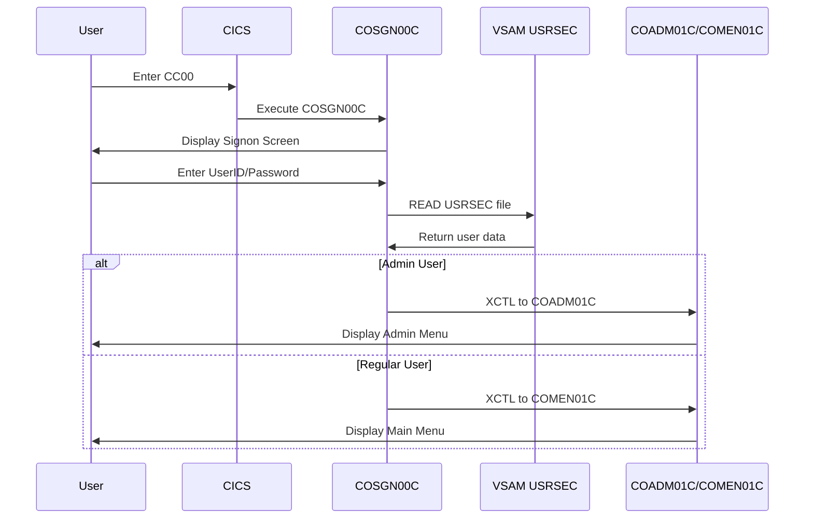
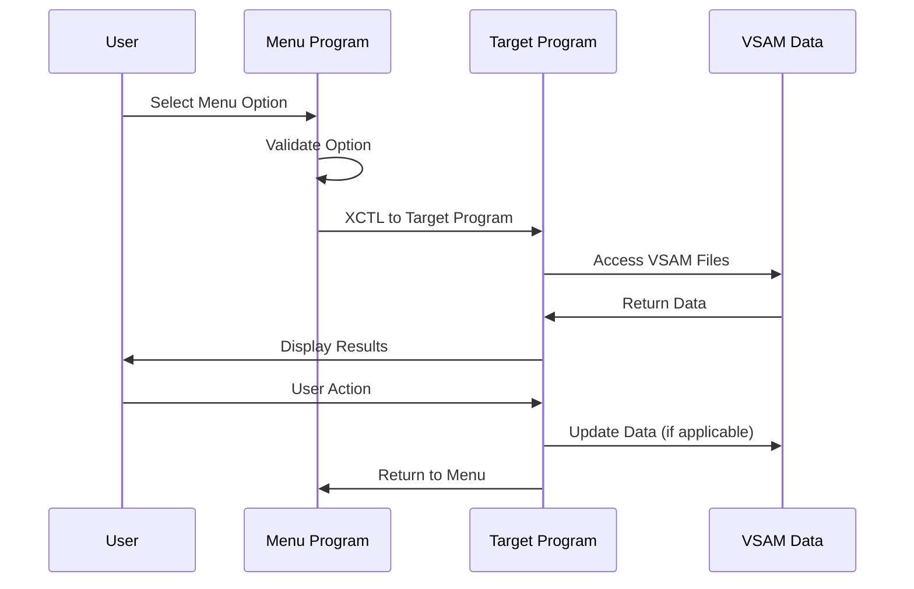
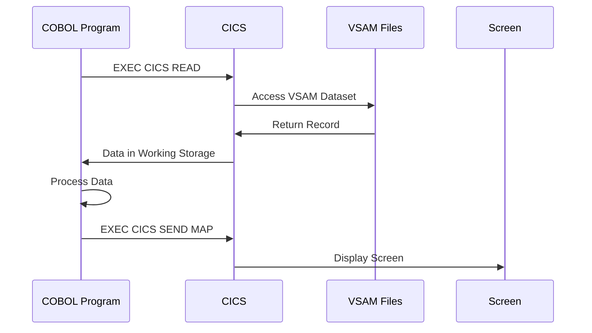

# CardDemo Application Flow Documentation

**Application:** AWS.M2.CARDDEMO  
**Type:** CICS COBOL Mainframe Application  
**Purpose:** Credit Card Management System

---

## Table of Contents

- [Application Entry Point](#application-entry-point)
- [Application Hierarchy](#application-hierarchy)
- [Transaction Mapping](#transaction-mapping)
- [User Flow Sequences](#user-flow-sequences)
- [Sequence Diagrams](#sequence-diagrams)
- [Program Dependencies](#program-dependencies)

---

## Application Entry Point

### Primary Entry Transaction: **CC00**

- **Program:** `COSGN00C` (Signon Screen)
- **Purpose:** User authentication and login
- **Screen:** Signon screen with User ID and Password fields
- **Next:** Routes to either Admin Menu (`COADM01C`) or User Menu (`COMEN01C`) based on user type

---

## Application Hierarchy

```
CC00 (COSGN00C) - Signon Screen
├── Authentication Check
├── Admin Users (User Type = 'A')
│   └── CA00 (COADM01C) - Admin Menu
│       ├── CU00 (COUSR00C) - User List
│       ├── CU01 (COUSR01C) - User Add
│       ├── CU02 (COUSR02C) - User Update
│       └── CU03 (COUSR03C) - User Delete
└── Regular Users (User Type = 'U')
    └── CM00 (COMEN01C) - Main Menu
        ├── CAVW (COACTVWC) - Account View
        ├── CAUP (COACTUPC) - Account Update
        ├── CCLI (COCRDLIC) - Credit Card List
        ├── CCDL (COCRDSLC) - Credit Card View
        ├── CCUP (COCRDUPC) - Credit Card Update
        ├── CT00 (COTRN00C) - Transaction List
        ├── CT01 (COTRN01C) - Transaction View
        ├── CT02 (COTRN02C) - Transaction Add
        ├── CR00 (CORPT00C) - Transaction Reports
        └── CB00 (COBIL00C) - Bill Payment
```

---

## Transaction Mapping

### Authentication & Navigation

| Transaction | Program  | Description   | User Type     |
| ----------- | -------- | ------------- | ------------- |
| **CC00**    | COSGN00C | Signon Screen | All           |
| **CA00**    | COADM01C | Admin Menu    | Admin Only    |
| **CM00**    | COMEN01C | Main Menu     | Regular Users |

### Account Management

| Transaction | Program  | Description    | User Type |
| ----------- | -------- | -------------- | --------- |
| **CAVW**    | COACTVWC | Account View   | All Users |
| **CAUP**    | COACTUPC | Account Update | All Users |

### Credit Card Management

| Transaction | Program  | Description        | User Type |
| ----------- | -------- | ------------------ | --------- |
| **CCLI**    | COCRDLIC | Credit Card List   | All Users |
| **CCDL**    | COCRDSLC | Credit Card View   | All Users |
| **CCUP**    | COCRDUPC | Credit Card Update | All Users |

### Transaction Management

| Transaction | Program  | Description      | User Type |
| ----------- | -------- | ---------------- | --------- |
| **CT00**    | COTRN00C | Transaction List | All Users |
| **CT01**    | COTRN01C | Transaction View | All Users |
| **CT02**    | COTRN02C | Transaction Add  | All Users |

### Reporting & Billing

| Transaction | Program  | Description         | User Type |
| ----------- | -------- | ------------------- | --------- |
| **CR00**    | CORPT00C | Transaction Reports | All Users |
| **CB00**    | COBIL00C | Bill Payment        | All Users |

### User Management (Admin Only)

| Transaction | Program  | Description | User Type  |
| ----------- | -------- | ----------- | ---------- |
| **CU00**    | COUSR00C | User List   | Admin Only |
| **CU01**    | COUSR01C | User Add    | Admin Only |
| **CU02**    | COUSR02C | User Update | Admin Only |
| **CU03**    | COUSR03C | User Delete | Admin Only |

### Developer/Utility

| Transaction | Program  | Description           | User Type |
| ----------- | -------- | --------------------- | --------- |
| **CDV1**    | COCRDSEC | Developer Transaction | Developer |

---

## User Flow Sequences

### 1. Application Startup Flow

```
User → CICS → CC00 (COSGN00C) → Signon Screen
```

### 2. Authentication Flow

```
Signon Screen → User Input → Authentication Check → Route by User Type
├── Admin User → CA00 (COADM01C) → Admin Menu
└── Regular User → CM00 (COMEN01C) → Main Menu
```

### 3. Admin User Flow

```
Admin Menu (CA00)
├── User Management
│   ├── CU00 → User List
│   ├── CU01 → User Add
│   ├── CU02 → User Update
│   └── CU03 → User Delete
└── Return to Signon (PF3)
```

### 4. Regular User Flow

```
Main Menu (CM00)
├── Account Operations
│   ├── CAVW → Account View
│   └── CAUP → Account Update
├── Credit Card Operations
│   ├── CCLI → Credit Card List
│   ├── CCDL → Credit Card View
│   └── CCUP → Credit Card Update
├── Transaction Operations
│   ├── CT00 → Transaction List
│   ├── CT01 → Transaction View
│   └── CT02 → Transaction Add
├── Reporting & Billing
│   ├── CR00 → Transaction Reports
│   └── CB00 → Bill Payment
└── Return to Signon (PF3)
```

---

## Sequence Diagrams

### 1. Application Login Sequence



### 2. Menu Navigation Sequence



### 3. Data Access Sequence



---

## Program Dependencies

### Core Programs

- **COSGN00C**: Entry point, authentication
- **COADM01C**: Admin menu and navigation
- **COMEN01C**: User menu and navigation

### Data Access Programs

- **COACTVWC/COACTUPC**: Account operations
- **COCRDLIC/COCRDSLC/COCRDUPC**: Credit card operations
- **COTRN00C/COTRN01C/COTRN02C**: Transaction operations
- **COUSR00C/COUSR01C/COUSR02C/COUSR03C**: User management

### Support Programs

- **CORPT00C**: Reporting functions
- **COBIL00C**: Bill payment processing

### Data Files

- **USRSEC**: User security and authentication
- **ACCTDAT**: Account data
- **CARDDAT**: Credit card data
- **CUSTDAT**: Customer data
- **TRANSACT**: Transaction data
- **CCXREF**: Card cross-reference data

---

## Key Application Features

### 1. **Security & Authentication**

- User-based access control
- Password validation
- Role-based menu access (Admin vs Regular User)

### 2. **Menu-Driven Interface**

- Hierarchical menu structure
- PF3 key for logout/return
- Input validation and error handling

### 3. **Data Operations**

- VSAM file access for high performance
- CRUD operations on business data
- Transaction integrity

### 4. **Navigation Control**

- XCTL for program transfers
- COMMAREA for data passing
- Return path management

### 5. **Error Handling**

- CICS response code checking
- User-friendly error messages
- Graceful error recovery

---

## Application Architecture Summary

The CardDemo application follows a **traditional CICS COBOL architecture** with:

1. **Single Entry Point**: CC00 transaction for authentication
2. **Role-Based Routing**: Different menus for Admin and Regular users
3. **Menu-Driven Navigation**: Hierarchical menu structure
4. **VSAM Data Storage**: High-performance indexed data access
5. **CICS Transaction Management**: Proper transaction boundaries
6. **Security Integration**: User authentication and authorization

This architecture provides a robust foundation for mainframe modernization and migration scenarios, demonstrating real-world patterns used in financial systems.
