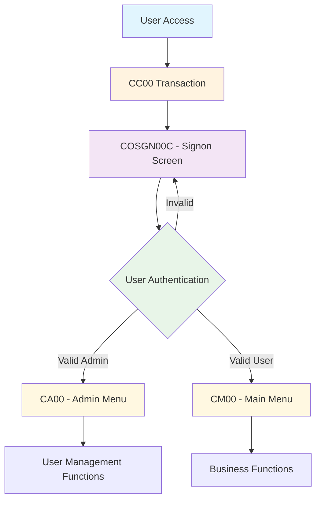
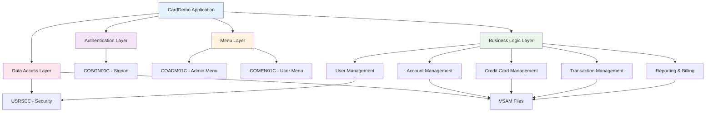
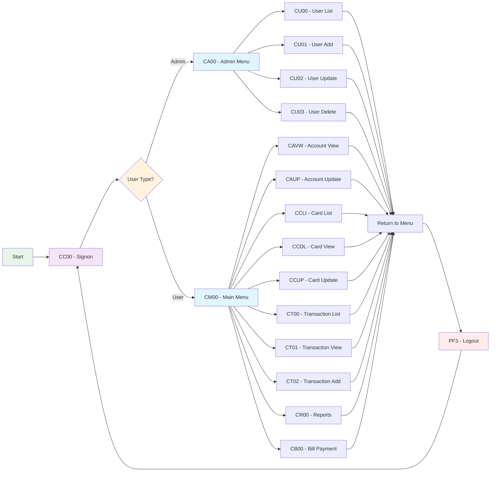
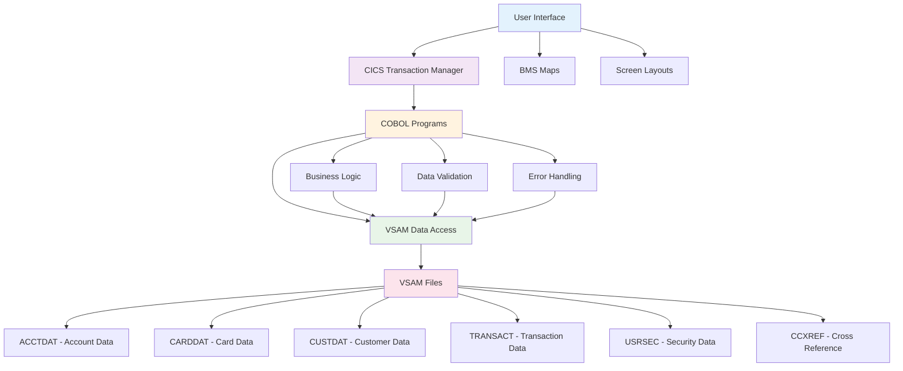
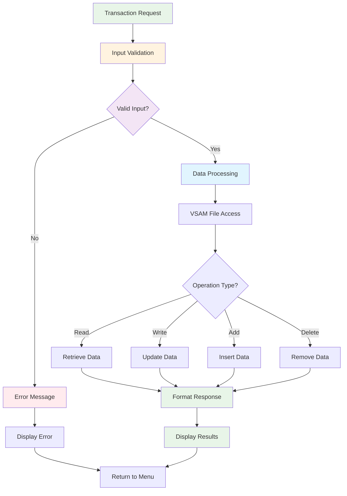
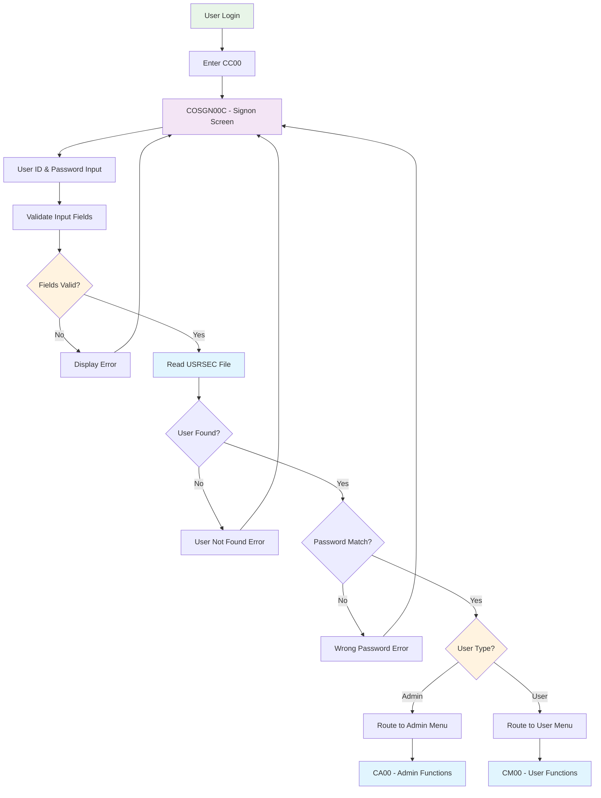
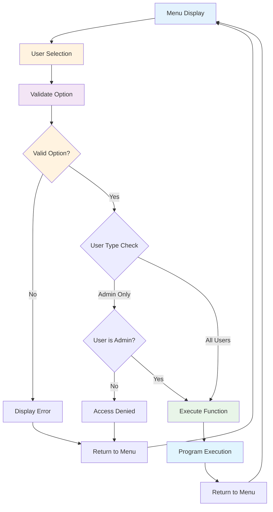
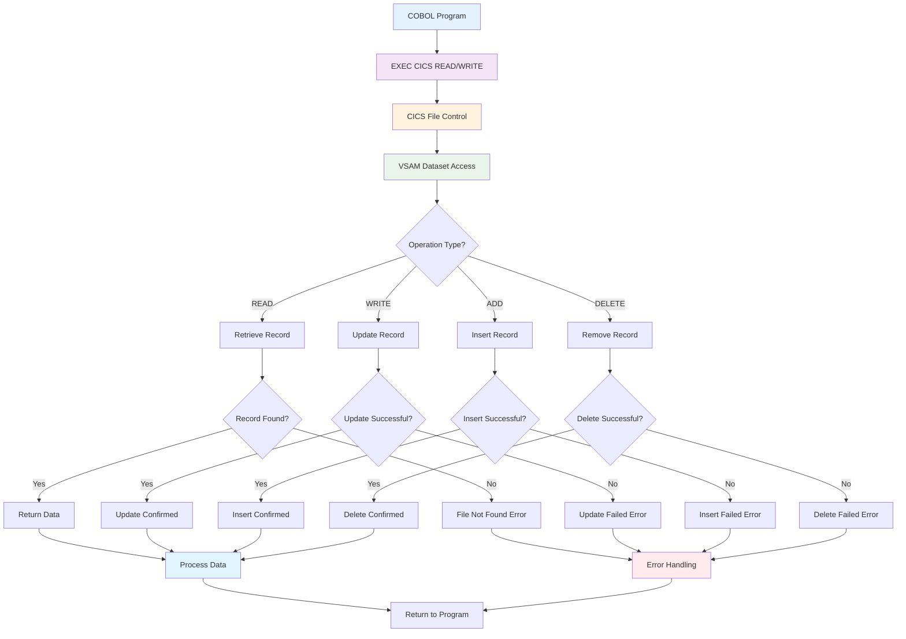

# CardDemo Mermaid Diagrams

**Application:** AWS.M2.CARDDEMO  
**Purpose:** Corrected Mermaid diagrams for CardDemo application flow

---

## 1. Application Entry Point Flow

---

## 2. Main Application Architecture

---

## 3. User Flow Sequence

---

## 4. Data Flow Architecture

---

## 5. Transaction Processing Flow

---

## 6. Security and Authentication Flow

---

## 7. Menu Navigation Flow

---

## 8. VSAM Data Access Flow

---

## Common Mermaid Syntax Issues and Solutions

### Issue 1: Graph Direction

**Problem:** `graph TD` syntax error
**Solution:** Use `flowchart TD` for top-down flowcharts

### Issue 2: Node References

**Problem:** Undefined node references
**Solution:** Ensure all nodes are properly defined before referencing

### Issue 3: Styling

**Problem:** Invalid style syntax
**Solution:** Use proper Mermaid styling syntax with `style` keyword

### Issue 4: Comments

**Problem:** Comment syntax not recognized
**Solution:** Use `%%` for single-line comments in Mermaid

### Issue 5: Subgraphs

**Problem:** Complex grouping issues
**Solution:** Use proper subgraph syntax with `subgraph` keyword

---

## Usage Notes

1. **Copy and paste** these diagrams into any Mermaid-compatible viewer
2. **Modify colors** by changing the style definitions
3. **Add new nodes** by following the existing pattern
4. **Update flows** by modifying the arrow connections
5. **Test syntax** in a Mermaid live editor before deployment

These diagrams provide a comprehensive view of the CardDemo application architecture and can be used for:

- **System documentation**
- **Migration planning**
- **Training materials**
- **Architecture reviews**
- **Development reference**
