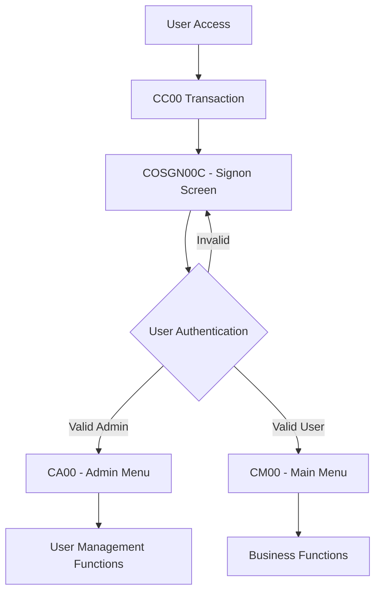
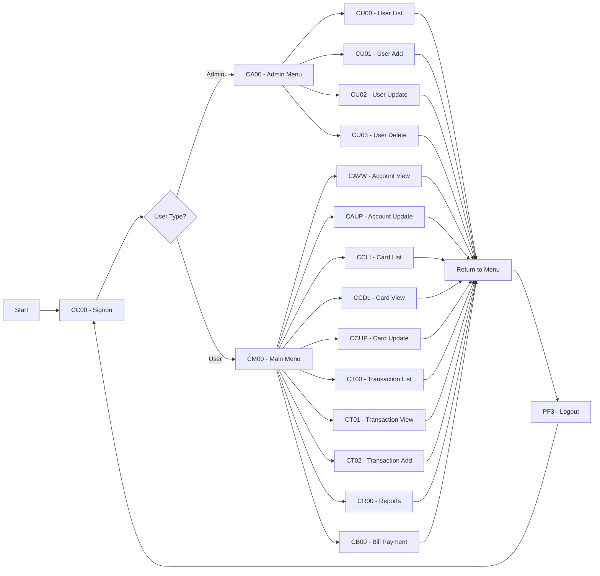
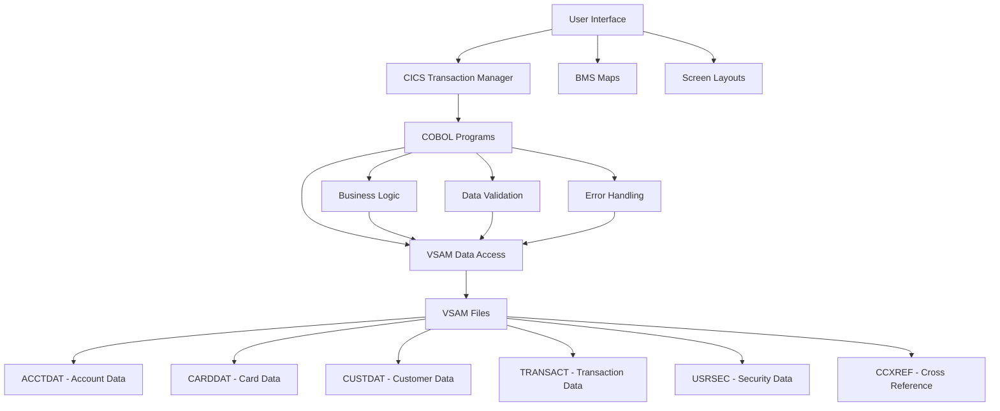
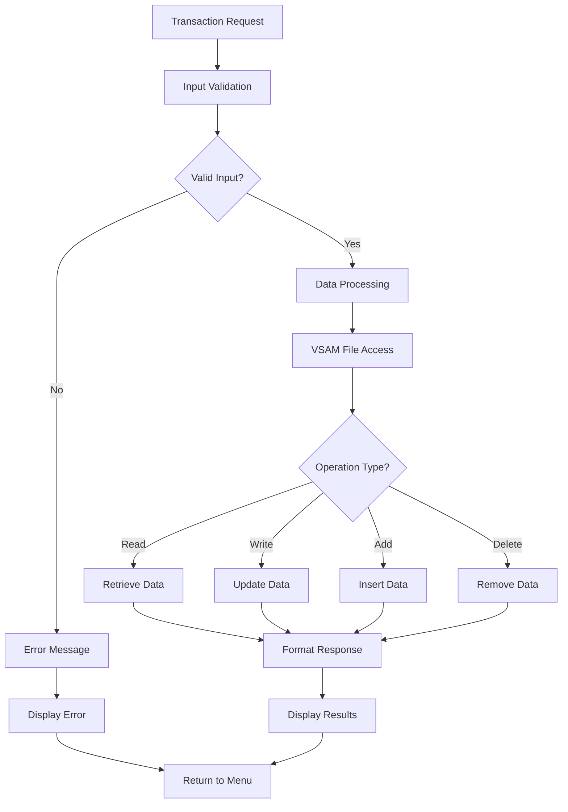
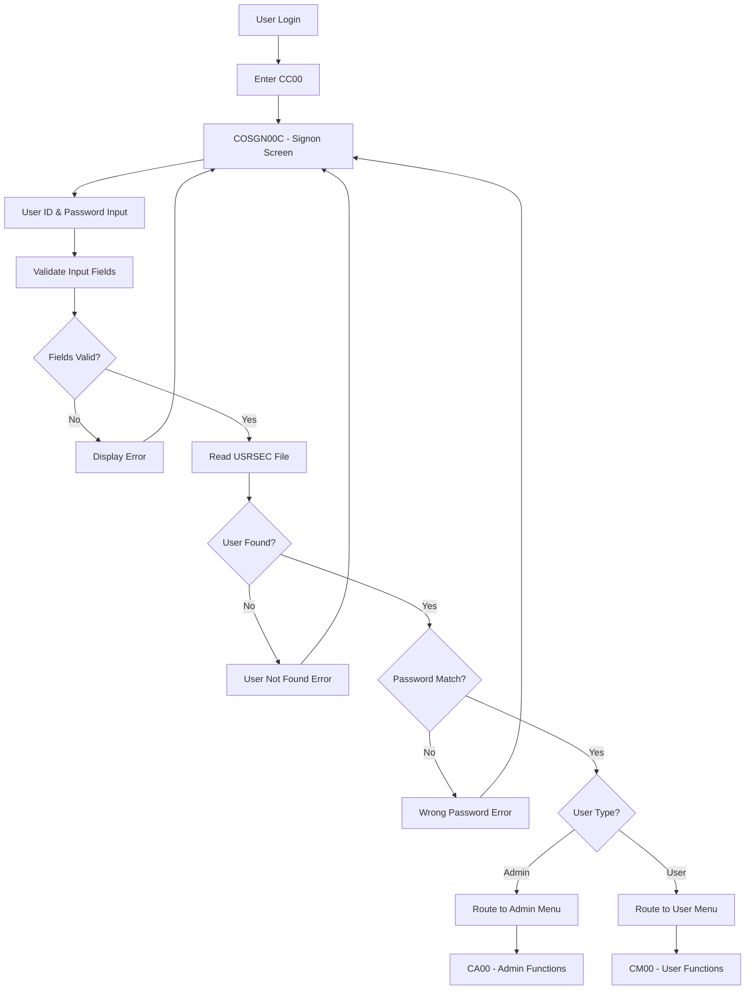
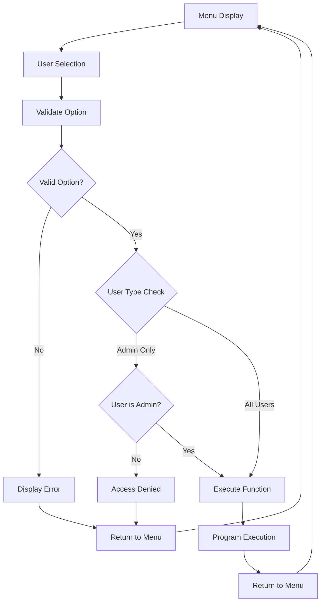
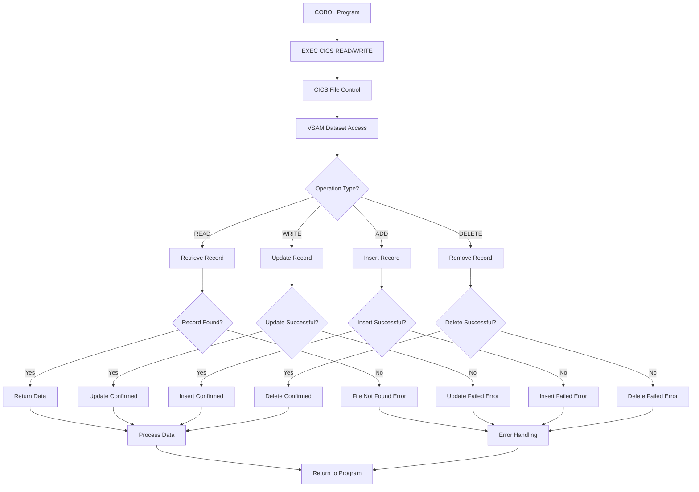
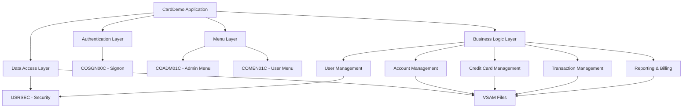
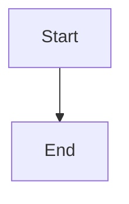

# CardDemo Simple Mermaid Diagrams

**Application:** AWS.M2.CARDDEMO  
**Purpose:** Simplified Mermaid diagrams for maximum compatibility

---

## 1. Basic Application Flow

---

## 2. User Navigation Flow

---

## 3. Data Flow Architecture

---

## 4. Transaction Processing Flow

---

## 5. Security and Authentication Flow

---

## 6. Menu Navigation Flow

---

## 7. VSAM Data Access Flow

---

## 8. Application Architecture Overview

---

## Troubleshooting Tips

### If you still get errors:

1. **Try this minimal test diagram:**

2. **Check your Mermaid version:**

   - Some older versions don't support `flowchart`
   - Use `graph` instead of `flowchart`

3. **Remove styling:**

   - The `style` commands might not be supported in all versions
   - Try without styling first

4. **Use a different viewer:**

   - [Mermaid Live Editor](https://mermaid.live/)
   - [Mermaid.js.org](https://mermaid.js.org/demo/)
   - GitHub/GitLab markdown

5. **Check for special characters:**
   - Some viewers are sensitive to special characters in node names
   - Use simple text without brackets or special symbols

---

## Usage Notes

These simplified diagrams should work with:

- **GitHub/GitLab** markdown rendering
- **Mermaid Live Editor**
- **VS Code** with Mermaid extensions
- **Most Mermaid viewers**

The diagrams show the same CardDemo application flow but use basic syntax for maximum compatibility.
